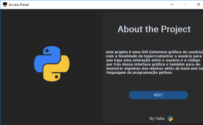

<h1>Sistema de Login</h1>

<h2>Bem vindo(ao) meu repositório</h2>

>Status do projeto: Em Desenvolvimento

## Descrição do projeto
 

esse projeto trata-se de um jogo simples, porem divertido e é claro, estamos falando do classico pacman

    
## Estados do game

:heavy_check_mark: `Estado 1:` Rodando

:heavy_check_mark: `Estado 2:` Pause

:heavy_check_mark: `Estado 3:` Game Over

:heavy_check_mark: `Estado 4:` winner
        
<video width="420" height="340" controls="controls">
    <source src="./filme.mp4" type="video/mp4">
</video>
 

    <h1>Sistema de cadastro<h1>
    

            
## Ferramentas utilizadas

 
    
<h2 style="text-align:left;">Redes Socias:</h2>
  <li style="text-align:center;"><a href="https://www.linkedin.com/in/habacuque-gosch-de-oliveira-993b45264/">Linkedin</a></li>
<li style="text-align:center;"><a href="https://www.instagram.com/gosch_tlgd"/>Instagram</a></li>

     
 
<h2>Guia</h2>

para rodar esse projeto em sua máquina, favor baixar o Banco de dados

>Banco de dados: DataUser

Logo após ter baixado, baixe a pasta de mídia do projeto

>Pasta: fotos
